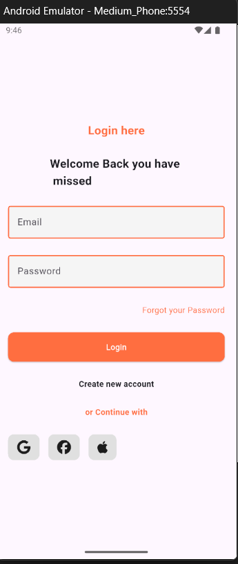

# Flutter Login UI 🔐

A clean and modern **Login Screen UI built with Flutter**.  
This project focuses on creating a simple, responsive, and visually appealing authentication interface.

## 📱 Preview

<p align="center">
  
</p>

## ✨ Features

- 🔐 Modern login interface
- 📧 Email input field
- 🔑 Password input field
- 👁️ Password visibility protection
- 🔗 Forgot Password option
- 🔓 Login button
- 👤 Create New Account option
- 🌐 Social login UI
  - Google
  - Facebook
  - Apple
- 🎨 Custom colors and borders
- 📱 Responsive Flutter UI

## 🛠️ Technologies Used

- Flutter
- Dart
- Material Design
- Font Awesome Flutter

## 📂 Project Structure

```text
lib/
│
├── main.dart
│
└── screens/
    └── login_screen.dart

assets/
└── login-screen.png